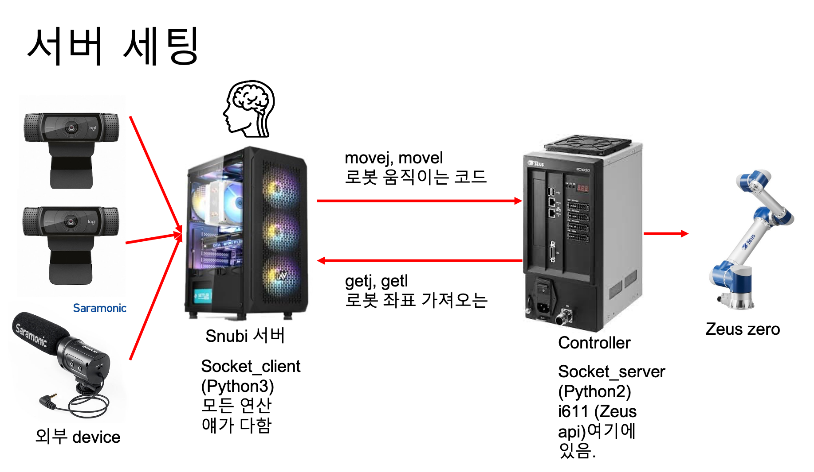

# snubi_zeus2022
roboworld 2022의 R-BIZ 챌린지를 위한 snubi팀 코드

  

### Required environment
- Ubuntu 20.04
- Python 3.7
- cuda 11.1

### Download model
detectron model 코드 
- [Google drive link](https://drive.google.com/drive/folders/1Wcq2GfciXhIvtQFdPic6z17PjJzO91z-?usp=sharing)  

### Running Scenario code
기본 구조는, socket통신 기준으로 snubi 컴퓨터가 client, zeus의 controller 가 server 입니다.
따라서 server 파일을 먼저 돌리고, client를 그 뒤 돌려 양쪽간 socket통신을 수행해 줍니다.

### Server Node
1. access to controller
```Shell
   ./connect_robot # ssh i611usr@192.168.0.23 
   pw : i611
   ```
2. python 파일 실행
```Shell
   python controller_receiver.py # i611 로봇 action 코드 
   ```
### Client Node
- 시나리오 코드를 실행할 경우
```Shell
   (venv) python robot_agent.py 
   >>> what is your name : [시나리오 코드 입력]
   ```

- 테스트 코드를 실행할 경우 

```Shell
   (venv) python test_client.py
   ```
1. 좌우 ad, 앞뒤 ws, 위아래 rf로 간단하게 tcp 이동
2. p,l로 그리퍼 close, open 가능
3. h로 home_pos 이동, gripper로 그리퍼 갈아끼기 모션으로 이동
4. 그밖에 추가적으로 필요하신 기능은 if 문 추가해서 만들어 주세요.

### Running Vision agent & Face agent

```Shell
   (venv) python vision_agent.py
   # another termianl
   (venv) python face_agent.py

```
### Running Django for Web UI

```Shell
   cd zeusweb-master
   (venv) python manage.py runserver
   # run "http://127.0.0.1:8000" in Chrome browser
```
